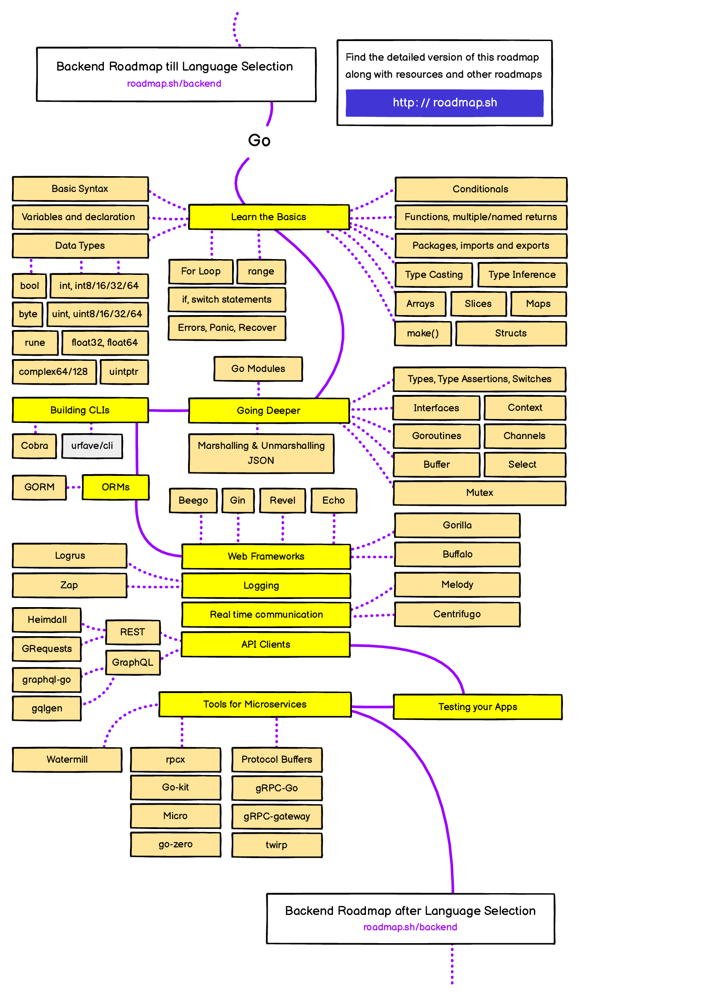

# Golang roadmap

## Learn the Basics

Learn the common concepts of Go like variables, loops, conditional statements, functions, data types, and so on. A good starting point for go basics is its Go's official docs.

- [Official Go Tutorial](https://go.dev/doc/tutorial/)

### Basic Syntax

Learn about the basic syntax of Go, such as how the go programs are executed, package imports, main function, and so on. Visit the resources listed below

- [Go Tutorial: Getting started](https://go.dev/doc/tutorial/getting-started)
- [Go by Example: Hello World](https://gobyexample.com/hello-world)
- [W3schools : Go Syntax](https://www.w3schools.com/go/go_syntax.php)

### Variables in Go

Variable is the name given to a memory location to store a value of a specific type. Go provides multiple ways to declare and use variables.

- [Go Variables](https://go.dev/tour/basics/8)
- [Go by Example: Variables](https://gobyexample.com/variables)
- [w3schools Go variables](https://www.w3schools.com/go/go_variables.php)

### Data Types

Go is a statically typed programming language, which means each variable has a type defined at first and can only hold values with that type. There are two categories of types in Go: basics types and composite types.

- [Basic data types](https://www.w3schools.com/go/go_data_types.php)
- [Tour of Go: types](https://go.dev/tour/basics/11)
- [Go types with examples](https://golangbyexample.com/all-data-types-in-golang-with-examples/)

### For Loop

Go has only one looping construct, the for loop. The basic for loop has three components separated by semicolons:

- the init statement: executed before the first iteration
- the condition expression: evaluated before every iteration
- the post statement: executed at the end of every iteration

### Range

Range is used with For Loops to iterate over each element in arrays, strings and other data structures.

### Conditional Statements

Conditional statements are used to run code only if a certain condition is true; go supports:

- if statements
- if / else statements
- switch case statements

### Errors panic recover

### Functions

Discover how functions work in Go, the list of resources below will cover:

- How to define and call functions in Go?
- Named returns in Go?
- Handle multiple return types.
- Different types of functions in Go.

### Packages

### Type Casting

Go doesn't support automatic type conversion, but it allows type casting, which is the process of explicitly changing the variable type.

### Type Inference

Type inference gives go the capability to detect the type of a value without being explicitly indicated , hence the posibility to declare variables without providing its type at first.

### Arrays

In Go an array is a collection of elements of the same type with a fixed size defined when the array is created.

### Slices

### Maps

### Make

### Structs

## Go advanced

- Go modules
- Working with json(Marshalling & Unmarshalling JSON)
- Types and type assertions
- Interfaces
- Goroutines
- Buffer
- Context
- Channels
- Select

### Mutex

Go allows us to run code concurrently using goroutines. However, when concurrent processes access the same piece of data, it can lead to race conditions. Mutexes are data structures provided by the sync package. They can help us place a lock on different sections of data so that only one goroutine can access it at a time.

- [Using a Mutex in Go with Examples](https://www.sohamkamani.com/golang/mutex/)

## Command lines

### Cobra

Cobra is a library for creating powerful modern CLI applications.

- [Cobra Github Repo](https://github.com/spf13/cobra)

### urfave/cli

A simple, fast, and fun package for building command line apps in Go.

- [Github](https://github.com/urfave/cli)

## ORMs

### GORM

The fantastic ORM library for Golang, aims to be developer friendly.

- [Github](https://github.com/go-gorm/gorm)

## Web Frameworks

### Beego

beego is an open-source, high-performance web framework for the Go programming language.

- [Github](https://github.com/beego/beego)

### Gin

Gin is a HTTP web framework written in Go (Golang). It features a Martini-like API with much better performance -- up to 40 times faster. If you need smashing performance, get yourself some Gin.

- [Github](https://github.com/gin-gonic/gin)

### Revel

A high productivity, full-stack web framework for the Go language.

- [Github](https://github.com/revel/revel)

### Echo

High performance, minimalist Go web framework.

- [Github](https://github.com/labstack/echo)

### Gorilla/mux

A powerful HTTP router and URL matcher for building Go web servers with 🦍.

- [Github](https://github.com/gorilla/mux)

### Buffalo

A Go web development eco-system, designed to make your project easier.

- [Github](https://github.com/gobuffalo/buffalo)

## Logging

### Zap

Blazing fast, structured, leveled logging in Go.

- [Github](https://github.com/uber-go/zap)

### Apex

Structured logging package for Go.

- [Github](https://github.com/apex/log)

### Zerolog

The zerolog package provides a fast and simple logger dedicated to JSON output.

Zerolog's API is designed to provide both a great developer experience and stunning performance. Its unique chaining API allows zerolog to write JSON (or CBOR) log events by avoiding allocations and reflection.

- [Github](https://github.com/rs/zerolog)

## Real time communication

### Melody

Minimalist websocket framework for Go.

- [Github](https://github.com/olahol/melody)

### Centrifugo

Scalable real-time messaging server in a language-agnostic way. Set up once and forever.

- [Github](https://github.com/centrifugal/centrifugo)

## Api Clients

### Rest

#### Heimdall

Heimdall is an HTTP client that helps your application make a large number of requests, at scale.

- [Github](https://github.com/gojek/heimdall)

#### GRequests

A Go "clone" of the great and famous Requests library.

- [Github](https://github.com/levigross/grequests)

### Graphql

#### graphql-go

GraphQL server with a focus on ease of use.

- [Github](https://github.com/graph-gophers/graphql-go)

#### gqlgen

go generate based graphql server library.

- [gqlgen](https://github.com/99designs/gqlgen)

## Testing

Go has a built-in testing command that we can use to test our program.

- [Official Go Tutorial: Add a test](https://go.dev/doc/tutorial/add-a-test)
- [Go by Example: Testing](https://gobyexample.com/testing)
- [YourBasic Go: Table-driven unit tests](https://yourbasic.org/golang/table-driven-unit-test/)

## Microservices

### Watermill

Building event-driven applications the easy way in Go.

- [Github](https://github.com/ThreeDotsLabs/watermill)

### rpcx

Best microservices framework in Go, like alibaba Dubbo, but with more features, Scale easily.

- [Github](https://github.com/smallnest/rpcx)

### Go-kit

Go kit is a programming toolkit for building microservices (or elegant monoliths) in Go. We solve common problems in distributed systems and application architecture so you can focus on delivering business value.

- [Github](https://github.com/go-kit/kit)

### Micro

API first development platform.

- [Github](https://github.com/micro/micro)

### go-zero

A cloud-native Go microservices framework with cli tool for productivity.

- [Github](https://github.com/zeromicro/go-zero)

### Protocol Buffers

Go support for Google's protocol buffers.

- [protobuf](https://github.com/golang/protobuf)

### gRpc-Go

The Go language implementation of gRPC. HTTP/2 based RPC.

- [Github](https://github.com/grpc/grpc-go)

### gRPC-gateway

gRPC to JSON proxy generator following the gRPC HTTP spec.

- [Github](https://github.com/grpc-ecosystem/grpc-gateway)

### twirp

A simple RPC framework with protobuf service definitions.

- [Github](https://github.com/twitchtv/twirp)

## Summary

Keep Learning.

Thanks [roadmap](https://roadmap.sh/).